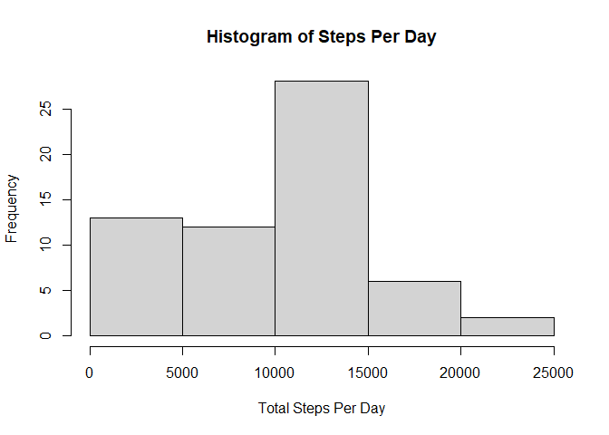
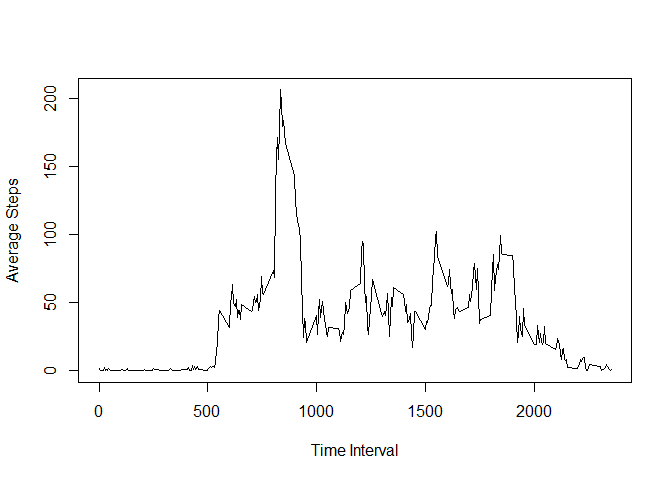
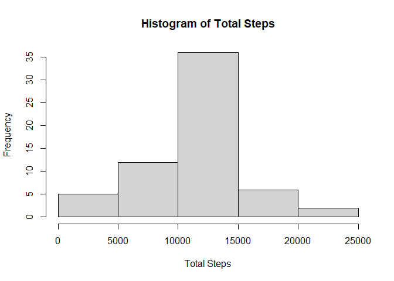
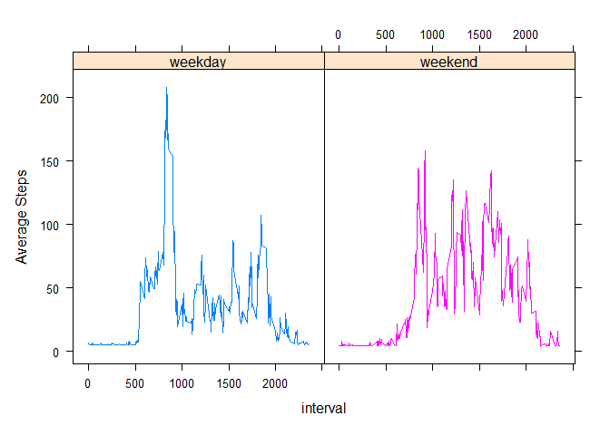

## Loading and preprocessing the data

```r
activity <- read.csv("activity.csv")
```


## What is mean total number of steps taken per day?

```r
library(dplyr)

totalSteps <- activity %>% select(steps, date) %>%
     group_by(date) %>%
     summarise(total_steps = sum(steps, na.rm = TRUE))

hist(totalSteps$total_steps, xlab = "Total Steps Per Day", main = "Histogram of Steps Per Day")
```

<!-- -->

### Mean and Median values
#### Mean


```r
mean(totalSteps$total_steps)
```

```
## [1] 9354.23
```
#### Median

```r
median(totalSteps$total_steps)
```

```
## [1] 10395
```


## What is the average daily activity pattern?

```r
averageStespsDF <- activity %>% select(steps, interval) %>%
     group_by(interval) %>%
     summarise(average_steps = mean(steps, na.rm = TRUE))

plot(averageStespsDF$interval, averageStespsDF$average_steps, type = "l", xlab = "Time Interval", ylab = "Average Steps")
```

<!-- -->

```r
maxStepsInterval <- averageStespsDF %>% filter(average_steps == max(average_steps))
```


#### Max Steps Interval


```r
maxStepsInterval$interval[1]
```

```
## [1] 835
```


## Imputing missing values

#### Number of Missing Values

```r
nas <- activity %>% filter(is.na(interval) | is.na(steps))
#number of missing values
dim(nas)[1]
```

```
## [1] 2304
```


```r
imputedDf <- activity
con <- is.na(activity$steps)
imputedDf[con,]$steps <- mean(imputedDf$steps, na.rm = TRUE)


imputedTotalSteps <- imputedDf %>% select(steps, date) %>%
     group_by(date) %>%
     summarise(total_steps = sum(steps))

hist(imputedTotalSteps$total_steps, xlab = "Total Steps", main = "Histogram of Total Steps")
```

<!-- -->

#### Mean Value


```r
mean(imputedTotalSteps$total_steps)
```

```
## [1] 10766.19
```


#### Median Value


```r
median(imputedTotalSteps$total_steps)
```

```
## [1] 10766.19
```

#### Impact of Imputing Data
##### We can see that imputing Data has changed The values of mean and median because we changed the data, also it made the mean very close to the mediane because more values are now equals the mean So it's more likely that the middle value will be the mean.

## Are there differences in activity patterns between weekdays and weekends?

```r
library(lattice)

weekDays <- imputedDf %>% mutate(weekDay = weekdays(as.POSIXlt(date)), fweekDay = "f")


weekDays[weekDays$weekDay %in% c("Saturday", "Sunday"),]$fweekDay <- "weekend"
weekDays[!( weekDays$weekDay %in% c("Saturday", "Sunday")),]$fweekDay <- "weekday"

weekDays <- weekDays %>% mutate(weekDay = as.factor(weekDay))

weekDays <- weekDays %>%
     group_by(interval, fweekDay) %>%
     summarise(average_steps = mean(steps))

xyplot(average_steps~interval|fweekDay, type = "l", data = weekDays, groups = fweekDay, layout = c(2, 1), ylab = "Average Steps")
```

<!-- -->

